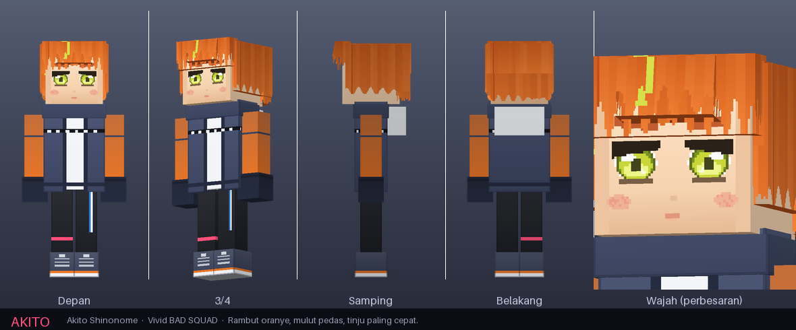
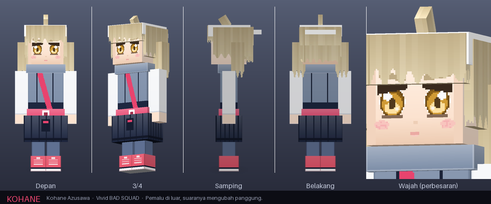
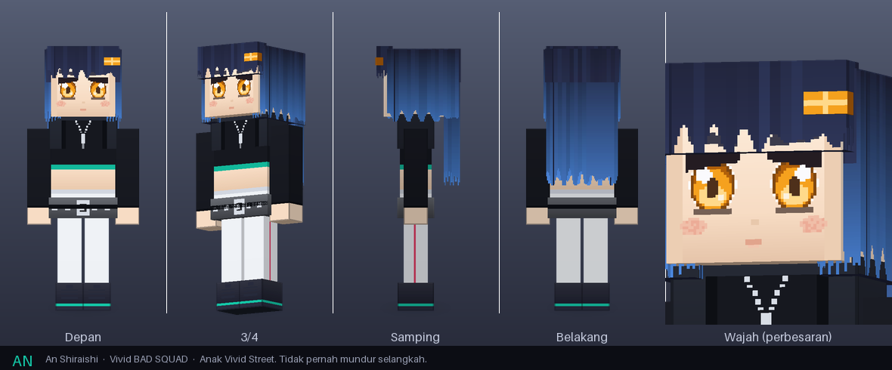
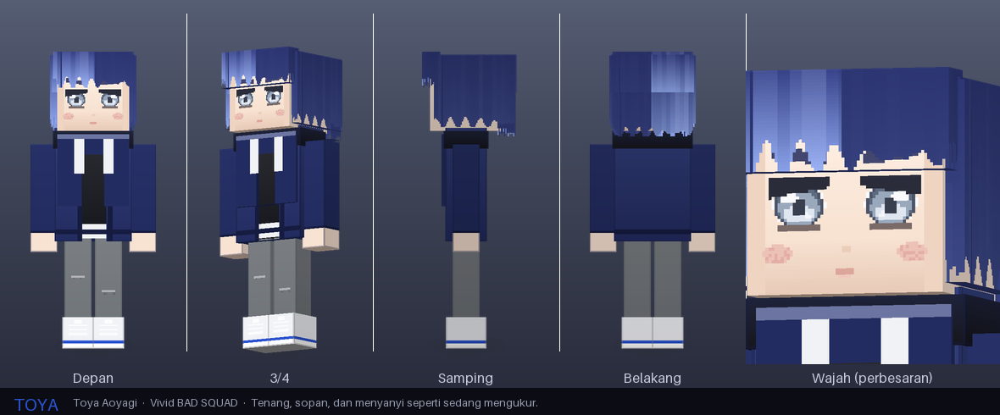
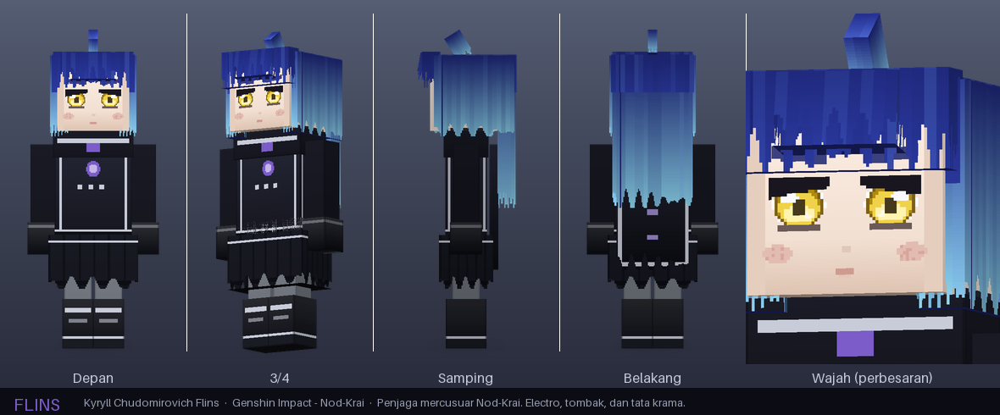

# VBS Companions

Add-on Minecraft **Bedrock** berisi lima karakter pendamping yang mengikuti pemain
ke mana pun, dan bisa disuruh **bertani** atau **bertarung** — perintahnya dipilih
lewat UI yang muncul setelah pemain **jongkok lalu klik/tap karakternya**.


Empat dari Vivid BAD SQUAD (Project SEKAI) — **Akito**, **Kohane**, **An**, **Toya** —
dan **Flins**, penjaga mercusuar Nod-Krai dari Genshin Impact. Model 3D dan
teksturnya (1024×1024) digambar dari nol untuk add-on ini.

---

## Pasang

### Di HP / PC (client)

Buka **`VBS-Companions-v1.0.0.mcaddon`** yang ada di folder ini. Minecraft memasang
kedua pack sekaligus. Lalu di pengaturan dunia, aktifkan **VBS Companions [Behavior]**
dan **[Resource]**.

Tidak ada satu pun toggle *Experimental* yang perlu dinyalakan — script-nya memakai
API versi stabil.

### Di dedicated server (BDS)

```bash
unzip VBS-Companions-v1.0.0.mcaddon -d /tmp/vbs
cp -r /tmp/vbs/vbs_companions_bp  <server>/behavior_packs/
cp -r /tmp/vbs/vbs_companions_rp  <server>/resource_packs/
```

Lalu daftarkan ke dunianya. `<server>/worlds/<nama dunia>/world_behavior_packs.json`:

```json
[
  { "pack_id": "e980994d-a9a6-469e-af1b-a31c3e9f7838", "version": [1, 0, 0] }
]
```

`<server>/worlds/<nama dunia>/world_resource_packs.json`:

```json
[
  { "pack_id": "b5872873-2873-40c9-8d5b-424bc5592785", "version": [1, 0, 0] }
]
```

Kalau berkasnya sudah ada, tambahkan entrinya ke dalam array yang sudah ada — jangan
ditimpa. Di `server.properties`, pastikan `texturepack-required=true` supaya semua
pemain mendapat modelnya. Restart server.

Minecraft Bedrock **1.21.0 ke atas**.

---

## Main

1. **Panggil karakternya** dengan spawn egg (ada di tab Item / creative, satu untuk
   tiap karakter), atau `/summon vbs:akito`.
2. Begitu muncul, dia langsung jadi milik pemain terdekat dan mulai mengikuti.
   *(Kalau versi gimmu tidak mengizinkan pengambilan pemilik otomatis, beri dia
   roti/apel/kue sekali — sesudah itu dia milikmu.)*
3. **Jongkok, lalu klik kanan** karakternya (di layar sentuh: jongkok, lalu tekan
   tombol **Buka Menu** yang muncul). UI-nya terbuka.

Yang tampil di UI: **pemilik, mode sekarang, Nyawa + batangnya, Armor beserta
bahannya, dan senjata yang dipegang** — lalu empat perintah:

| Perintah | Yang dia lakukan |
|---|---|
| **Ikuti Aku** | Menempel di dekatmu ke mana pun, termasuk pindah dimensi. Ketinggalan lebih dari 20 blok? Ditarik pulang otomatis. |
| **Mode Bertani** | Menyusuri ladang di sekitarnya, memanen tanaman matang, **menanamnya kembali**, dan hasilnya masuk ke kantongmu. Kalau ada petak tanah subur kosong dan kamu punya bibit, dia ikut menanam. |
| **Mode Bertarung** | Menyerang monster dalam radius 16 blok, membalas yang menyerangmu, dan ikut menyerang yang kamu pukul. Kuda-kudanya berubah kalau sedang siaga. |
| **Diam di Tempat** | Berjaga di titik itu. Tidak mengikuti, tidak ditarik pulang. |

Menu **Perlengkapan & Lainnya** berisi: memakaikan zirah/senjata dari tanganmu,
memberi makan untuk memulihkan nyawa, melepas semua perlengkapan, mengganti nama
panggilan, memanggilnya ke tempatmu, dan mengistirahatkannya.

Mode yang dipilih **tersimpan** — dunia ditutup lalu dibuka lagi, perintahnya tetap.

Tanaman yang dikenali mode bertani: gandum, wortel, kentang, bit, dan nether wart.

### Kelima karakter

| Karakter | Nyawa | Damage | Kecepatan | Radius tani | |
|---|---|---|---|---|---|
| **Akito** Shinonome | 28 | 6 | 0.33 | 5 | Paling kuat berkelahi |
| **Kohane** Azusawa | 24 | 4 | 0.32 | 6 | Paling ringan, cepat lincah |
| **An** Shiraishi | 30 | 5 | 0.34 | 6 | Paling tahan pukulan |
| **Toya** Aoyagi | 26 | 5 | 0.32 | 7 | Radius tani terluas |
| **Flins** | 32 | 7 | 0.33 | 5 | Nyawa dan damage tertinggi |

Companion **tidak bisa dilukai pemain**, jadi pukulan nyasar tidak akan membunuhnya.

<details>
<summary>Lembar karakter (klik untuk buka)</summary>







</details>

---

## Yang perlu diketahui

- **Zirah bekerja, tapi tidak terlihat di badannya.** Titik armornya nyata dan
  mengurangi damage yang masuk, dan angkanya ada di UI — tapi modelnya kustom, dan
  Bedrock hanya menggambar zirah di atas kerangka model vanilla.
- **Mengikuti dijamin dua lapis.** Selain pathfinding bawaan gim, ada pemeriksaan
  jarak tiap 2 detik yang menarik companion pulang kalau tersangkut tembok, tenggelam,
  atau kamu pindah dimensi.
- **Mode bertani tidak butuh bibit** untuk menanam ulang yang baru dipanen; bibit
  dari kantongmu hanya dipakai kalau dia menemukan petak subur yang kosong.
- Karya penggemar. Semua tekstur dan model digambar sendiri untuk add-on ini —
  interpretasi pixel-art, bukan aset dari Project SEKAI maupun Genshin Impact, dan
  tidak berafiliasi dengan SEGA/Colorful Palette maupun HoYoverse.

---

## Untuk yang mau mengubah

Semuanya lahir dari satu berkas data, `tools/characters.json` — palet warna, gaya
rambut, potongan baju, dan statistik tiap karakter. Ganti satu warna di sana, jalankan
ulang generatornya, dan model, tekstur, entity, preview, semuanya ikut berubah.

```bash
cd tools
python3 gen_geometry.py      # -> models/entity/vbs_companions.geo.json
python3 gen_textures.py      # -> semua PNG (tekstur 1024x1024, spawn egg, pack icon)
python3 gen_packs.py         # -> manifest, entity behavior + resource, lang
python3 render_preview.py    # -> docs/preview/*.png
python3 validate.py          # periksa semua kaitan antar berkas
python3 build_mcaddon.py     # -> VBS-Companions-v1.0.0.mcaddon
```

Butuh Python 3 dan Pillow (`pip install pillow`). Hasil generatornya ikut di-commit,
jadi orang yang cuma mau memasang add-on ini tidak perlu Python sama sekali.

| Berkas | Isinya |
|---|---|
| `tools/characters.json` | Satu-satunya sumber kebenaran: palet, gaya, statistik |
| `tools/uvmap.py` | Peta UV 1024×1024, 8 texel per satuan model |
| `tools/model.py` | Bentuk tiap karakter: bone dan kubusnya |
| `tools/render_preview.py` | Renderer ortografis + z-buffer, untuk gambar preview |
| `tools/validate.py` | 1000+ pemeriksaan kaitan antar berkas |
| `behavior_packs/.../scripts/` | UI, mode, mode bertani, tali penarik |

`validate.py` memeriksa hal-hal yang biasanya baru ketahuan setelah add-on dipasang:
identifier entity behavior vs resource vs script vs teks, bone yang disebut animasi
tapi tidak ada di geometry, UV yang keluar tekstur, component group yang dipanggil
event tapi tidak didefinisikan, tekstur yang ditunjuk tapi tidak ada, dan UUID
manifest yang bentrok.
