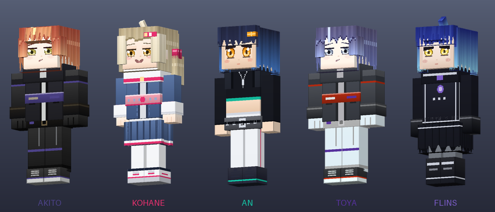
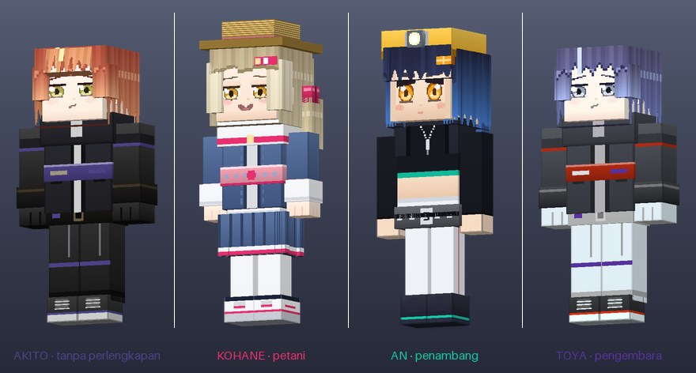
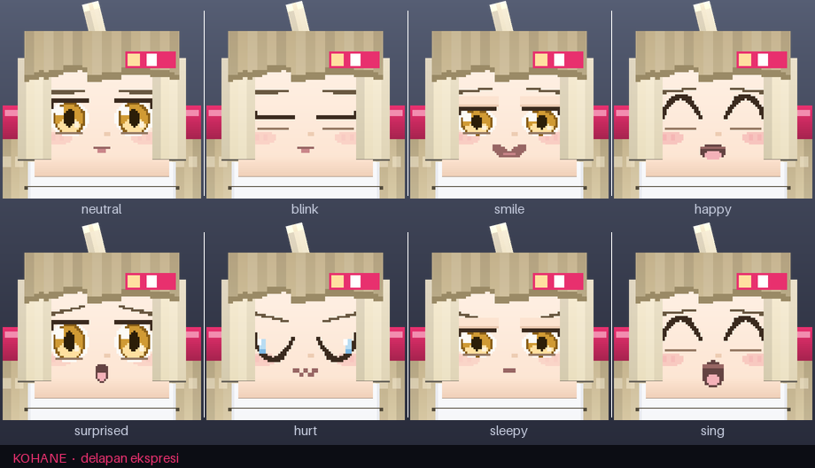
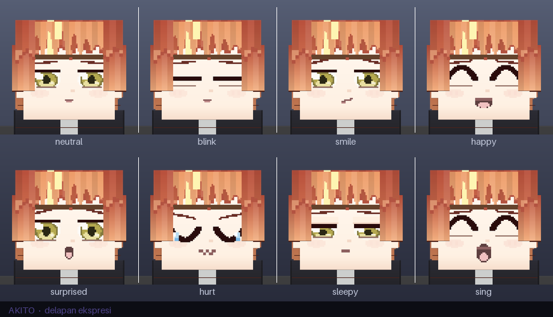

# VBS Companions

Add-on Minecraft **Bedrock** berisi lima karakter pendamping yang mengikuti pemain
ke mana pun, dan bisa disuruh **bertani, bertarung, menambang, mengembara,
membangun, merajin** atau **mencari barang** — perintahnya dipilih lewat UI yang
muncul setelah pemain **jongkok lalu klik/tap karakternya**.



Empat dari Vivid BAD SQUAD (Project SEKAI) — **Akito**, **Kohane**, **An**, **Toya** —
dan **Flins**, penjaga mercusuar Nod-Krai dari Genshin Impact. Model 3D dan
teksturnya (1024×1024) digambar dari nol untuk add-on ini.

---

## Pasang

Add-on ini dibungkus jadi **dua berkas terpisah**, satu per pack:

| Berkas | Isinya |
|---|---|
| `VBS-Companions-v2.0.0-BP.mcaddon` | Behavior pack — entity, mode, dan seluruh script |
| `VBS-Companions-v2.0.0-RP.mcaddon` | Resource pack — model, tekstur, animasi, teks |

**Keduanya harus dipasang.** Manifest keduanya saling menyebut sebagai dependensi,
jadi memasang salah satu saja akan membuat Minecraft mengeluh pasangannya tidak ada.
Urutan pemasangannya bebas.

### Di HP / PC (client)

Buka kedua berkas itu satu per satu. Minecraft memasang masing-masing ke tempatnya.
Lalu di pengaturan dunia, aktifkan **VBS Companions [Behavior]** dan **[Resource]**.

Tidak ada satu pun toggle *Experimental* yang perlu dinyalakan — script-nya memakai
API versi stabil.

### Di dedicated server (BDS)

```bash
unzip VBS-Companions-v2.0.0-BP.mcaddon -d /tmp/vbs
unzip VBS-Companions-v2.0.0-RP.mcaddon -d /tmp/vbs
cp -r /tmp/vbs/vbs_companions_bp  <server>/behavior_packs/
cp -r /tmp/vbs/vbs_companions_rp  <server>/resource_packs/
```

Lalu daftarkan ke dunianya. `<server>/worlds/<nama dunia>/world_behavior_packs.json`:

```json
[
  { "pack_id": "e980994d-a9a6-469e-af1b-a31c3e9f7838", "version": [2, 0, 0] }
]
```

`<server>/worlds/<nama dunia>/world_resource_packs.json`:

```json
[
  { "pack_id": "b5872873-2873-40c9-8d5b-424bc5592785", "version": [2, 0, 0] }
]
```

Kalau berkasnya sudah ada, tambahkan entrinya ke dalam array yang sudah ada — jangan
ditimpa. Di `server.properties`, pastikan `texturepack-required=true` supaya semua
pemain mendapat modelnya. Restart server.

Minecraft Bedrock **1.21.0 ke atas**.

---

## Main

1. **Panggil karakternya** dengan spawn egg (ada di tab Item / creative, satu untuk
   tiap karakter), atau `/summon vbs:akito`.
2. Begitu muncul, dia **liar (untamed)** — belum mengikuti siapa pun. Beri dia
   **satu bunga, bunga apa saja** (poppy, dandelion, tulip, dst.) — jongkok atau
   tidak, dua-duanya boleh. Bunganya habis dipakai, dan dia langsung jadi milikmu.

   Yang menjinakkan adalah **mesin gim sendiri**, lewat `minecraft:tameable`
   dengan daftar bunga di `tame_items` — persis cara serigala dijinakkan dengan
   tulang. Script cuma mencatat siapa pemiliknya sesudah itu. Bunga di luar
   daftar (mis. *pink petals*) tetap bisa dipakai lewat jalur script sebagai
   cadangan.
3. **Jongkok, lalu klik kanan** karakternya (di layar sentuh: jongkok, lalu tekan
   tombol **Buka Menu** yang muncul). UI-nya terbuka. Selama masih liar, jongkok
   dan klik hanya menampilkan pesan "beri dia bunga dulu" — menunya belum bisa
   dibuka.
4. **Buku Panduan** langsung ada di kantongmu begitu masuk dunia. Pakai bukunya
   untuk membaca panduan, mengendalikan companion dari jauh, dan mengatur mod
   ini — dan buku itu tidak akan hilang walaupun kamu mati (lihat bagian
   tersendiri di bawah). Bisa juga ditempa sendiri: **satu buku + satu bunga**.

### Penanda di atas kepala

Companion liar memakai penanda **`[Nama, liar]`**. Begitu dijinakkan, formatnya
berubah jadi **`[Nama, tugas, Owner]`** —

```
[Kohane, Bertani, manukmiber]
```

Itu dibuat untuk server: satu pemain bisa tahu companion siapa itu dan sedang
disuruh apa dari jauh, tanpa perlu mendekat dan membuka menunya. Kalau companion
sedang bicara, kalimatnya muncul sebagai baris di ATAS penanda, jadi penandanya
tidak pernah hilang.

Bagian **Owner** di penanda itu bisa disembunyikan lewat menu **Pengaturan &
Perlengkapan** — kalau dimatikan, pemain lain di server tidak akan tahu
companion itu milik siapa hanya dengan melihat penandanya.

### Dua belas perintah

| Perintah | Yang dia lakukan |
|---|---|
| **Ikuti Aku** | Menempel di dekatmu ke mana pun, termasuk pindah dimensi. Ketinggalan lebih dari 24 blok? Ditarik pulang otomatis. Satu-satunya mode yang begini — mode lain dibiarkan di chunk tempat mereka bekerja. |
| **Mode Bertani** | Meratakan lahan, membuka ladang, membuat alatnya sendiri, menanam berpola, memanen, mengairi, dan menghias. Lihat bagian tersendiri di bawah. |
| **Mode Bertarung** | Menyerang monster dalam radius 20 blok, membalas yang menyerangmu, dan ikut menyerang yang kamu pukul. Pakai pedang atau **busur** — tergantung apa yang kamu pasangkan di tangannya. |
| **Diam di Tempat** | Berjaga di titik itu. Tidak mengikuti, tidak ditarik pulang. |
| **Mode Menambang** | Menggali tangga turun sampai kedalaman bijih yang kamu minta, membuat terowongan bercabang selebar 1 dan setinggi 3 blok berobor, lalu menyetorkan bijih **dan batu/tanah galiannya** ke peti. |
| **Mode Mengembara** | Menjelajah spiral melebar dari base, mencatat temuan beserta koordinatnya, memungut barang di jalan, dan pulang menyetor. |
| **Mode Membangun** | Membangun rumah desa (kalau ada chunk yang dipatok) lalu rancangan pilihanmu, dari bahan yang ada di peti stasiun. |
| **Mode Merajin** | Menempakan alat DAN barang (ember, peti, papan nama, meja kerja, obor) pesanan companion lain, lalu mengantarnya ke peti si pemesan. |
| **Mode Mencari Barang** | Mencari bahan yang **diminta** companion lain — kayu, batu, besi, tanah, arang, bibit — lalu mengantarnya ke peti si pemesan. |
| **Mode Berdagang** | Membawa **kelebihan** isi peti ke villager terdekat, menukarnya jadi emerald, lalu membeli bahan yang sedang diminta companion lain. |
| **Mode Memancing** | Membuat joran sendiri, mencari perairan yang cukup besar, berdiri di tepinya, melempar kail, lalu **menunggu** sampai umpannya disambar. |
| **Mode Beternak** | Memagari kandang di chunk desa, menggiring hewan masuk, memberi makan, membiakkan sampai batas populasi, mencukur, memerah, dan memungut telur. |

Menu **Pengaturan & Perlengkapan** berisi: memakaikan zirah/senjata/alat dari
tanganmu, memberi makan, melepas perlengkapan, mengatur ladang dan patok, memilih
rancangan bangunan, membaca catatan pengembara, **menunjuk ranjang tempat dia
tidur**, mematikan celotehnya, menyembunyikan nama pemilik (untuk dia saja atau
untuk semua companion milikmu), melihat **papan permintaan bantuan**, membaca
**catatan kejadian/log**, mengganti nama panggilan, memanggilnya ke tempatmu, dan
mengistirahatkannya.

Mode yang dipilih **tersimpan** — dunia ditutup lalu dibuka lagi, perintahnya tetap.

---

## Buku Panduan: satu buku yang tidak bisa hilang

Ditempa di meja kerja dari **satu buku + satu bunga** (bunga apa saja dari daftar
resep — bunga yang sama yang dipakai menjinakkan companion). Pakai bukunya
(klik kanan, atau tahan di layar sentuh) untuk membukanya.

Isinya:

| Halaman | Isinya |
|---|---|
| **Cara Pakai** | Sepuluh bab: menjinakkan, sembilan perintah, bertani, membangun & rancangan, mengajak bicara, pertanyaan companion, buku sebagai alat, balai kerja bersama, tenaga & tempat tidur, api & air |
| **Kendalikan Companion** | Daftar companion milikmu beserta tugas dan **apa yang sedang dikerjakan**. Pilih satu untuk membuka halamannya (di bawah), atau beri **satu perintah untuk semuanya sekaligus** |
| **Peta Patok** | Peta 8×8 chunk di sekitarmu — **satu-satunya cara** memasang patok ladang maupun patok desa |
| **Pertanyaan Companion** | Companion yang sedang menunggu keputusanmu, dan jawabannya |
| **Pengaturan Mod** | Tujuh saklar milik **kamu**, bukan milik satu companion |
| **Isi Tambahan & Status** | Rancangan dan dialog yang datang dari berkas JSON, dan status Beta API |

### Halaman satu companion

Memilih satu companion di **Kendalikan Companion** membuka halamannya sendiri.
Semuanya bekerja dari jarak berapa pun, lintas dimensi:

| Tombol | Isinya |
|---|---|
| **Sedang Apa** | Pekerjaan yang sedang dikerjakan detik ini, tugas, tenaga, kantuk, dan bahan yang sedang ditunggu — sama persis dengan jawaban `chat <nama> lagi ngapain?` |
| **Isi Peti & Kantong** | Isi peti stasiunnya **dan** kantong pribadinya. Keduanya, karena selama peti belum berdiri semua hasil kerjanya hidup di kantong — peti kosong bukan berarti dia tidak bekerja |
| **Ngobrol** | Kotak teks: ketik pesannya, jawabannya masuk ke chatmu. Perintah kerja yang diselipkan di dalam kalimat tetap dituruti |
| **Jawab Pertanyaannya** | Muncul kalau dia sedang menunggu jawaban |
| **Apa yang Ditambang** | Khusus penambang: centang bijih yang kamu cari, dan saklar bawa-pulang batu & tanah galian |
| **Peta Patok** | Muncul untuk petani (ladang) dan pembangun (desa) |
| **Tunjuk Ranjang** | Ranjang tempat dia tidur — ranjang di dekat **kamu**, walau dia sedang bekerja jauh |
| **Menu Lengkap** | Menu companion yang biasa — perintah, perlengkapan, ladang, rancangan |

### Tidak bisa hilang

Buku ini dijaga **tiga lapis**, karena satu lapis saja tidak cukup:

1. **Mati** — begitu respawn, bukunya ada lagi di kantong.
2. **Dibuang atau dilempar** — item-nya dipungut kembali seketika, dengan pesan
   yang menjelaskan kenapa.
3. **Hilang cara lain** (kantong penuh, `/clear`, dunia lama yang belum pernah
   punya buku) — denyut lima detik memeriksa dan mengembalikannya.

Kalau kamu memang ingin membuangnya, matikan saklar **"Buku ini tidak bisa
hilang"** di dalam bukunya sendiri; sesudah itu dia berlaku seperti item biasa.

### Tujuh saklar pengaturan per pemain

Setelan ini disimpan **per pemain di tingkat dunia** — berlaku untuk seluruh
companion milikmu, tetap ada sesudah dunia ditutup, dan tidak ikut hilang kalau
satu companion diistirahatkan.

| Saklar | Bawaan | Yang berubah |
|---|---|---|
| Sembunyikan nama pemilik | mati | Namamu hilang dari penanda kepala dan papan stasiun semua companionmu |
| Bungkam semua celoteh | mati | Mereka tetap bekerja, cuma tidak bersuara |
| Gelembung teks di atas kepala | hidup | Kalau dimatikan, kalimatnya masuk chat biasa — bukan hilang |
| Laporan jarak jauh masuk chat | hidup | Panen selesai, minta bahan, tawaran membangun kampung |
| Pesan petunjuk | hidup | "Jongkok dulu", "beri dia bunga" |
| Buku ini tidak bisa hilang | hidup | Pengembalian otomatis di atas |
| Kirim peringatan & error ke chat | mati | Sama dengan saklar di menu Catatan Kejadian |

Kalau bukunya tertinggal entah di mana, dua jalan lain membukanya:
`!panduan` diketik di chat, atau `/scriptevent vbs:panduan`.

---

## Berhenti dan tersenyum saat dilihat

Kalau kamu **mengarahkan pandangan** ke seorang companion dari jarak 10 blok atau
kurang, dia **berhenti melakukan apa pun**, menoleh, tersenyum, dan melambai.
Begitu kamu memalingkan muka, dia lanjut bekerja dari titik yang sama.

Ini berlaku **tanpa kecuali**, termasuk saat dia sedang bertarung — itu memang
yang diminta, dan konsekuensinya nyata: companion yang kamu tatap di tengah
pertarungan akan membeku sambil melambai dan bisa mati konyol. Kalau ternyata
mengganggu, ubah satu baris di `behavior_packs/.../scripts/config.js`:

```js
export const LOOK = {
  stopInCombat: true,   // ganti ke false: saat bertarung dia cuma tersenyum, tidak berhenti
  ...
};
```

Tidak ada baris lain yang perlu ikut diubah.

### Kalau yang menatap PEMAIN LAIN

Di server, tatapan orang asing tidak diperlakukan sama. Companion **menyapa
orang itu dengan namanya** — kalimatnya diambil dari pool `hail`, jadi tiap
karakter menyapa dengan gayanya sendiri — dan **memberi tahu pemiliknya lewat
chat** bahwa ada orang di dekat companionnya, lengkap dengan koordinat:

```
[An] Yo! Kenal Pemilik, gak?
[An] Ada Bagas di dekatku, di (65, -48).
```

Sapaannya dijeda per orang (sekali per 30 detik), dan laporan ke pemiliknya jauh
lebih jarang (sekali per dua menit) — pemain yang berdiri lama di dekat ladangmu
tidak berubah jadi banjir pesan. Kalau kamu tidak mau laporannya sama sekali,
matikan **Laporan jarak jauh masuk chat** di pengaturan buku.

---

## Api, air, dan makan

Tiga hal yang sebelumnya tidak ada sama sekali, dan akibatnya terlihat jelas:
companion berjalan lurus ke tengah danau lalu **mengambang di sana** sampai
ditarik pulang, badan yang tersulut api terus berjalan sambil terbakar walau ada
sungai tiga blok di sebelahnya, dan nyawa yang tinggal separuh tidak pernah
pulih.

### Menghindari air

Langkah kaki companion sekarang **selalu memilih pijakan kering**. Langkah yang
harus berpijak di atas air cuma dipakai sebagai cadangan — kalau memang tidak
ada satu pun jalan kering ke arah tujuannya.

Menyeberangi **parit irigasi selebar satu blok tetap boleh**, dan memang harus:
di situ lantainya tanah, cuma kakinya yang tercelup. Companion yang panik tiap
kali menyeberangi paritnya sendiri tidak akan pernah menyelesaikan satu ladang.

### Terbakar → nyemplung

Badan yang terbakar **berhenti bekerja**, mencari air terdekat dalam 12 blok,
dan nyemplung. Api padam, pekerjaan dilanjutkan dari titik yang sama.

### Terlanjur di air dalam → berenang

Yang sudah terlanjur di tengah danau **berenang naik ke permukaan** satu blok
tiap denyut (bukan meloncat keluar sekaligus — itu terlihat seperti sihir), lalu
menuju **daratan terdekat** dan naik ke sana.

Kalau kepalanya terlalu lama terbenam, dia benar-benar **kehabisan napas** dan
kamu diberi tahu lewat chat. Nyawa yang hilang karena itu tidak hilang begitu
saja — lihat di bawah.

### Nyawa tinggal sedikit → makan

Companion yang nyawanya turun di bawah 60% **makan sendiri**, dari peti
stasiunnya atau dari kantong pribadinya, apa pun yang ada di daftar makanan
(roti, apel, daging matang, kue, ...). Dia tidak berhenti bekerja untuk itu — dia
makan sambil jalan.

Tidak ada makanan sama sekali? Dia **memesan roti ke Perajin** lewat papan
permintaan yang sama seperti pesanan alat, dan memberi tahu pemiliknya:

```
[Kohane] Aku tadi hampir tenggelam. Tolong ada yang buatkan makanan.
```

Perajin yang menerima pesanan itu tidak kaku: kalau di peti kebetulan **sudah
ada makanan apa pun**, dia mengantar yang itu alih-alih menunggu tiga gandum dari
ladang yang belum panen. Roti baru ditempa kalau memang tidak ada apa-apa.

---

## Mode bertani, lengkapnya

Mode ini yang paling banyak berubah. Urutan yang dikerjakan companion selalu sama,
dan dia berhenti di langkah pertama yang belum beres — **alasannya selalu terbaca
di baris "Sekarang" di menu utama**, jadi companion yang berdiri diam bukan misteri.

Ladang dikerjakan sebagai **rangkaian fase yang tidak boleh dibalik**:

| Fase | Yang dikerjakan |
|---|---|
| **Meratakan** | Seluruh petak berpatok diturunkan/ditimbun ke satu ketinggian |
| **Mengairi** | Parit digali utuh, ember dibuat dan diisi di sungai, air dituang |
| **Mencangkul** | Hanya petak yang **sudah kebagian air** yang jadi farmland |
| **Menanam** | Bibit ditanam berjalur |
| **Merawat** | Panen, tanam ulang, perbaiki petak yang mengering, menghias |

Fase yang sedang berjalan ikut ditampilkan di menu utama (baris **Tahap**).

Urutan inilah inti perbaikannya. Versi sebelumnya mencampur semuanya dalam satu
sapuan — tanah dicangkul lebih dulu di kolom mana pun yang kebetulan disentuh,
paritnya baru digali belakangan — sehingga petak yang keburu jadi farmland tanpa
air balik lagi jadi tanah biasa. Sekarang **tidak ada satu petak pun dicangkul
sebelum benar-benar ada air yang menjangkaunya**, dihitung persis seperti aturan
Minecraft: air dalam empat blok mendatar, setinggi atau satu di atas farmland.

### 1. Stasiun

Companion memakai peti stasiun **miliknya sendiri** — atau peti stasiun companion
lain milik pemilik yang sama. Peti pemain yang kebetulan ada di dekat situ tidak
pernah diserobot, jadi hasil kerjanya tidak akan tercampur ke petimu.

Petinya berdiri di **balai kerja bersama** (lihat babnya di bawah), bukan di
tempat kakinya kebetulan berhenti — itulah yang membuat kiriman antar companion
benar-benar sampai.

Peti dan papan namanya **tidak muncul dari udara**: peti butuh **delapan papan**,
papan nama butuh **enam papan dan satu stik**. Selama bahannya belum ada,
companion tetap bekerja memakai **kantong pribadinya** — bentuknya sama persis
dengan peti, cuma tidak kelihatan — dan seluruh isinya dipindahkan ke peti begitu
petinya berdiri. Kalau kayunya kurang, dia memasang permintaan ke **Mencari
Barang** dan tetap bekerja sambil menunggu.

Papan namanya bertuliskan nama companion, tugasnya, pemiliknya dan chunk tempatnya
berdiri — kecuali kalau nama pemilik disembunyikan (lihat *Menyembunyikan nama
pemilik* di bawah).

### 2. Alat

Dia melihat isi peti dan naik **satu tingkat setiap kali** — kayu dulu, baru batu,
besi, emas, lalu intan — bukan langsung melompat ke tingkat terbaik yang bahannya
ada. Mencari **meja kerja** di dekat stasiun (memasang satu sendiri dari papan
kalau belum ada), berjalan ke sana, dan membuat cangkulnya di situ. Kalau
**Merajin** menitipkan cangkul jadi di peti, dia dipakai langsung tanpa menempa
ulang.

### 3. Menanam berpola

Ladang dibagi jadi **jalur selebar dua blok**, dan jalur ke-n memakai bibit ke-n
dari isi peti. Patokannya tepi ladang, bukan posisi companion, jadi barisnya tetap
di tempat yang sama walau dunia ditutup dan dibuka lagi. Hasilnya ladang berbaris,
bukan tertanam acak.

### 4. Panen yang tidak instan

Companion **tidak mencabut begitu saja**. Dia berjalan ke tanamannya, **jongkok**,
**mengayun-ayunkan tangan** selama kira-kira dua detik sambil mengeluarkan
partikel dan suara — baru kentangnya lepas, dan langsung **ditanam ulang** di
tempat yang sama. Hasilnya **selalu masuk ke peti stasiun**, tidak pernah
langsung ke kantongmu — supaya companion lain (Merajin, misalnya) bisa memakai
hasil panen itu juga, dan kamu tetap bisa melihatnya menumpuk di peti.

Kalau kamu menatapnya di tengah panen, dia berhenti dan tersenyum; panennya
dilanjutkan setelah kamu memalingkan muka.

### 5. Topi jerami

Companion yang sedang bertani otomatis memakai **topi jerami**. Penambang memakai
**helm berlampu**, pengembara memakai **ransel**. Warnanya sama untuk semua
karakter — supaya di server, dari jauh, langsung terbaca siapa sedang mengerjakan apa.



### 6. Patok chunk — hanya lewat buku

Sebelum boleh melebarkan ladang, companion butuh izin, dan izin itu berbentuk
**patok chunk**. Patoknya **bukan item**: satu-satunya jalan memasangnya adalah
**Buku Panduan » Peta Patok**.

> Sampai v1.6.0 patok berupa sebatang stik bernama yang harus dibawa dan
> diklikkan ke tanah. Itu gagal dua arah sekaligus — stik bernama tenggelam di
> antara stik biasa yang memang dibuat perajin berkarung-karung, dan chunk di
> seberang lembah tetap harus didatangi dulu. Item patoknya **dihapus**, dan
> semua jalur masuknya (menu companion, tawaran Pembangun) sekarang menunjuk ke
> halaman peta.

Begitu satu petak ditunjuk, sebuah **penanda muncul di tengah chunk** dengan
pancaran warna ke langit:

| Warna | Artinya |
|---|---|
| **Merah** | Sudah dipatok, tapi belum digarap jadi ladang (atau belum dibangun) |
| **Hijau** | Sudah jadi ladang (atau rumahnya sudah berdiri) |

Tunjuk petak yang sama sekali lagi untuk mencabut patoknya. Patok disimpan di
tingkat dunia, jadi tetap ada walau companion yang menggarapnya diistirahatkan.

#### Peta Patok

Halaman itu menggambar **8×8 chunk di sekitarmu** (128×128 blok) sekaligus:

```
x -4 .. 3
z   -4  -- -- -- -- -- -- -- --
z   -3  -- -- -- -- -- -- -- --
z   -2  -- -- -- -- -- ## -- --
z   -1  -- -- -- -- -- -- -- --
z    0  -- -- -- -- XX -- -- --
z    1  -- -- -- -- -- -- -- --
```

| Petak | Artinya |
|---|---|
| `--` abu-abu | Kosong, belum dipatok |
| `##` merah | Dipatok, belum digarap |
| `##` hijau | Sudah jadi ladang |
| `##` hijau tua | Lahan desa |
| `##` abu-abu | Dipatok pemain lain |
| `XX` kuning | Petak tempat kamu berdiri sekarang |

Pilih satu baris, lalu tunjuk petaknya — patok terpasang atau tercabut di
tempat, dari mana pun kamu berdiri. Tombol di bawah peta bisa mematok chunk
tempat kamu berdiri dengan satu ketukan, dan berganti antara **Patok Ladang**
dan **Patok Desa** — dua-duanya halaman yang sama, tidak ada item yang ditukar.

Halaman itu juga menjawab "patokku yang kemarin di mana": di bawah peta ada
**arah dan jarak ke patok terdekatmu** (misalnya *"36 blok ke timur laut,
chunk (1, -2)"*). Penanda chunk yang hilang karena dunia sempat ditutup juga
**dipasang ulang sendiri** begitu kamu berdiri cukup dekat.

Patok pemain lain tidak bisa dicabut.

**Tanpa patok**, companion hanya menggarap radius kecil di sekitar stasiun dan
tidak pernah mencangkul tanah baru — jadi dia tidak akan pernah membongkar
kebunmu sendiri tanpa diminta.

Chunk yang dipatok juga **diratakan dulu** ke satu ketinggian sebelum dicangkul
— kelebihan tanah dibongkar, kekurangannya ditimbun pakai tanah dari peti kalau
ada. Sebelumnya companion langsung mencangkul kontur asli yang berundak, dan
sebagian petak jadi tidak kebagian air karena bedanya ketinggian.

Ketinggian itu diambil dari **median dua puluh lima kolom contoh** di dalam
chunk, bukan dari satu titik saja — satu lubang atau satu gundukan di tengah
petak tidak boleh menentukan tinggi seluruh ladang.

> **Patok lama yang tidak pernah jalan.** Sampai v1.6.0 yang tersimpan adalah
> tinggi **kaki pemain**, bukan tinggi **tanahnya** — dua blok terlalu tinggi.
> Akibatnya setiap kolom petak terbaca "cekung": petani menghabiskan seluruh
> waktunya meminta tanah timbun yang tidak pernah cukup, dan dari luar dia
> terlihat cuma berdiri diam di samping petinya. Rumah desa pun berdiri
> melayang dua blok di atas rumput. Patok lama **dibetulkan sendiri** begitu
> companion pertama menggarapnya; yang sudah selesai digarap dibiarkan apa
> adanya, karena permukaannya memang sudah terlanjur dibentuk ke situ.

### 7. Mengairi dan melebar

Pengairan dikerjakan sungguhan, langkah demi langkah:

1. Companion menggali **parit selebar satu blok tiap delapan kolom**, utuh dari
   ujung ke ujung petak. Lantai paritnya ditambal supaya airnya tidak bocor, dan
   tanah galiannya disimpan untuk menimbun petak yang cekung.
2. Kalau di peti belum ada **ember**, dia **membuatnya sendiri** dari **tiga
   batang besi** di meja kerja. Tidak ada besi? Dia memasang permintaan besi ke
   **Merajin** dan **Mencari Barang**, lalu menunggu sambil mengerjakan yang lain.
3. Ember dibawa ke **sungai terdekat**, diisi, dibawa balik, dan dituang jadi
   **sumber air tiap enam blok** sepanjang parit. Airnya mengalir mengisi sisanya.
4. Baru sesudah itu petak di kiri-kanan parit dicangkul. Jarak parit sengaja
   delapan blok supaya petak terjauh pun tetap dalam empat blok dari air.

Kalau ternyata tidak ada sungai sama sekali dalam jangkauan, companion melapor ke
pemiliknya dan mengerjakan petak yang kebetulan sudah dekat air alami saja — jadi
fitur ini tetap berguna untuk base yang jauh dari sungai.

Kalau nanti ada petak yang mengering lagi (paritnya tertimbun, airnya diambil),
fase merawat mendeteksinya dan companion kembali memperbaiki pengairannya.

Untuk melebar **satu chunk lagi**, nyalakan izinnya di menu **Ladang & Patok**, dan
patok chunk keduanya. Tanpa izin itu, companion berhenti di chunk pertama.

### 8. Menghias

Setelah tidak ada lagi yang matang, tidak ada petak kosong, dan tidak ada tanah
yang perlu dicangkul, companion menghias sawahnya dari bahan yang ada di peti:
pagar keliling, lampu tiap lima langkah, jerami di sudut, dan **orang-orangan sawah**
(pagar + labu) di tengah. Yang tidak ada bahannya dilewati.

---

## Menambang, Mengembara, Membangun

### Menambang

Menggali **tangga turun** dari permukaan sampai Y −54 (Overworld), satu blok maju
satu blok turun, dengan **obor tiap delapan anak tangga**. Sampai di bawah, dia
menggali **terowongan utama selebar 1 dan setinggi 3 blok**, dan **cabang
sepanjang delapan blok tiap tiga blok** berselang kiri dan kanan — jarak tiga
blok itu yang bikin tidak ada urat bijih yang terlewat. Bijih yang menempel di
dinding maupun di langit-langit ikut diambil.

Tasnya penuh? Dia **pulang menyetor ke peti stasiun**, lalu turun lagi ke tempat
terakhirnya menggali. Blok buatan pemain, peti, dan lava tidak pernah disentuh;
kalau ujung galian membentur salah satunya, arah galiannya dibelokkan.

Butuh beliung — dibuatnya sendiri dari bahan di peti, sama seperti cangkul.

#### Batu dan tanah galian ikut dibawa pulang

Yang dibawa pulang **bukan cuma bijih**. Batu, tanah, kerikil, pasir, deepslate —
apa pun yang mau tidak mau harus dibongkar supaya lorongnya lewat — ikut disetor
ke peti, sampai satu tumpuk per jenis.

Sebelumnya semuanya menguap: satu terowongan sepanjang lima puluh blok berarti
ratusan blok batu yang lenyap dari dunia tanpa pernah masuk peti siapa pun,
sementara di permukaan petani berdiri menunggu **tanah timbun** dan pembangun
kehabisan **batu**. Sekarang rantainya nyambung — penambang yang bekerja
seharian memasok dua bahan yang paling sering ditunggu companion lain.

Kalau kamu memang cuma mau bijih, matikan di **Buku Panduan » Apa yang
Ditambang » Jangan bawa pulang batu & tanah**.

### Mengembara

Satu-satunya mode yang sengaja **tidak** mengikuti pemilik: tugasnya menjauh.
Jalurnya **spiral melebar** dari stasiun, sampai jari-jari 190 blok, lalu pulang.

Sepanjang jalan dia **mencatat temuan** — desa, mulut gua, peti terbengkalai,
danau lava, reruntuhan — beserta koordinatnya, dan **melaporkannya lewat chat**.
Catatan itu disimpan di tingkat dunia dan bisa dibaca lagi kapan saja lewat menu
**Catatan Pengembara**. Barang yang tergeletak di jalannya dipungut dan dibawa
pulang ke peti.

### Membangun

Pilih rancangan di menu **Rancangan Bangunan**:

| Rancangan | Isinya |
|---|---|
| Pagar keliling ladang | Pagar satu blok keliling petak, lampu tiap lima langkah |
| Tembok keliling | Tembok tiga blok mengelilingi petak |
| Tiang lampu | Tiang berlampu tiap enam blok di dalam petak |
| Jalan setapak ke pemilik | Jalan lurus dari stasiun ke tempatmu berdiri |
| Jembatan | Jembatan berpagar 24 blok ke arah hadap companion |
| Gubuk 5×5 | Lantai, dinding, jendela, pintu, atap, satu lampu |
| Gudang 7×5 | Seperti gubuk, lebih besar, lengkap dengan peti di dalam |

Bahannya diambil dari peti stasiun, dan rancangan **menyebut peran blok** —
"dinding", "lantai", "atap", "lampu" — bukan blok tertentu. Jadi gubuk yang sama
jadi gubuk kayu kalau petimu berisi papan, dan gubuk batu kalau berisi batu bulat.
Yang tidak ada bahannya dilewati, dan alasannya muncul di baris "Sekarang".

#### Membangun kampung

Di menu **Rancangan Bangunan** ada tombol **Peta Patok Desa**: halaman peta yang
sama, cuma jenis patoknya yang berbeda. Tunjuk chunk mana saja yang boleh
dibangun rumah — bisa lebih dari satu chunk sekaligus, dan chunk "desa" ini
terpisah dari chunk ladang (patok yang salah akan ditolak dengan pesan, bukan
menimpa yang lain). Pembangun yang belum punya satu pun chunk desa akan
**menawarkan sendiri** lewat chat dan menunjuk ke halaman itu.

Begitu **Mode Membangun** dipilih, Pembangun mengerjakan chunk desa yang belum
dibangun LEBIH DULU, sebelum rancangan blueprint biasa: satu rumah 5×5 lengkap
lantai, dinding, jendela, pintu, atap, peti, **dan satu ranjang** per chunk.
Setelah rumahnya jadi, ranjangnya **benar-benar ditugaskan** ke satu companion:
namanya dicatat di rumah itu, dan posisi ranjangnya ditulis ke state companion
tersebut — kolom yang sama persis yang dipakai waktu kamu menunjuk ranjang
sendiri. Sejak itu dia pulang ke rumahnya sendiri tiap mengantuk, dan companion
berikutnya tidak akan diberi ranjang yang sama.

Yang dipilih: companion yang **belum punya ranjang** dan yang paling jauh dari
rumah barunya — yang selama ini bekerja paling jauh dari kampung tanpa tempat
pulang. Pembangunnya sendiri ikut antre seperti yang lain. Ranjang yang **kamu
tunjuk sendiri** tidak pernah ditimpa penugasan kampung.

> Sampai versi sebelumnya, "rumahmu sudah jadi" cuma satu baris chat yang tidak
> mengubah apa pun: companion yang mengantuk tetap tidur di ranjang terdekat mana
> pun, termasuk ranjang yang sama dengan kawannya.

#### Jalan dan penerangan

Sesudah rumah terakhir berdiri, Pembangun **tidak berhenti**. Dia meneruskan
sendiri dua pekerjaan umum:

- **Jalan** selebar dua blok antara tiap rumah dan balai kerja. Yang dibangun
  pohon rentang: tiap titik disambungkan ke titik terdekat yang sudah tersambung,
  jadi kampung sepuluh rumah dapat sembilan ruas jalan — bukan empat puluh lima,
  dan yang sembilan itu semuanya terpakai. Ruas yang lebih panjang dari 64 blok
  dilewati.
- **Penerangan**: lampu jalan tiap enam langkah (di **tepi** jalan, bukan di
  tengah — companion yang berjalan pulang tidak boleh menabrak tiang lampunya
  sendiri), lalu obor di titik gelap kampung supaya monster tidak lahir di dalam
  rumah yang baru dibangun kemarin.

Rumput yang diinjak jadi jalan **tidak menghabiskan apa pun**, persis seperti
sekop di vanilla. Yang menghabiskan bahan cuma kerikil, dan itu cuma dipakai di
petak yang tanahnya memang bukan tanah (pasir pantai, batu tebing). Obornya
dirakit sendiri dari stik dan arang kalau petinya kosong.

Kalau kamu ingin dia tidur di rumah buatanmu sendiri, **tunjuk ranjangnya** —
lihat bagian di bawah.

#### Rancangan sendiri dari berkas JSON

Tujuh rancangan di tabel atas dihitung kode. **Rancangan baru tidak perlu kode
sama sekali**: taruh satu berkas `.json` di folder
[`blueprints/`](blueprints/), jalankan generatornya, dan rancangan itu muncul di
menu **Rancangan Bangunan** bertanda `JSON`.

```bash
cd tools && python3 gen_blueprints.py && python3 build_mcaddon.py
```

Inilah gunanya kalau kamu menemukan skema bangunan Minecraft di internet
(`.schematic`, `.nbt`, `.litematic`, atau bahkan cuma gambar): suruh AI
mengubahnya ke skema di [`blueprints/README.md`](blueprints/README.md), simpan
hasilnya di folder itu, selesai. Kalimat yang bisa langsung dipakai ada di
README folder itu.

Bentuknya denah huruf per lapis, dengan **palette** yang memberi arti tiap huruf:

```json
{
  "id": "watchtower",
  "label": "Menara Pengawas",
  "origin": "center",
  "palette": { "#": { "role": "wall" }, "L": { "role": "light" }, ".": { "role": "air" } },
  "layers": [{ "y": 0, "rows": ["#####", "#...#", "#...#", "#...#", "#####"] }]
}
```

Tiga hal yang membuat bentuk ini betah dipakai:

- **Peran, bukan blok.** `"role": "wall"` berarti companion memakai papan, batu
  atau gelondongan — apa pun yang ada di petinya. Blok tertentu tetap boleh
  (`"block": "minecraft:cobblestone"`), dan kalau blok itu habis, perannya
  dipakai sebagai cadangan alih-alih berhenti.
- **Bangunan JSON dibangun rata.** Ketinggian dasarnya dikunci sekali di kolom
  tempat companion berdiri, jadi menara di lereng bukit tetap menara — tidak
  ikut naik-turun mengikuti kontur seperti pagar keliling ladang.
- **Ditolak lebih awal.** Generator menolak huruf yang tidak ada di palette,
  peran yang tidak dikenal, baris yang panjangnya berbeda, dan rancangan yang
  lebih besar dari 32×32×32 atau 8000 langkah. `validate.py` menolak kalau
  berkas JSON dan hasil generatornya tidak sinkron — jadi "sudah kutaruh tapi
  tidak muncul" ketahuan sebelum add-on dipasang.

Dua contoh ikut di dalam folder itu: **Menara Pengawas** (bentuk `layers`) dan
**Sumur Desa** (bentuk `blocks`, yaitu daftar koordinat jarang seperti hasil
konversi schematic).

---

## Berdagang, Memancing, Beternak

Rantai kerja add-on ini selalu berhenti di tempat yang sama: **di peti**. Petani
memanen tiga ratus gandum, penambang membawa pulang enam tumpuk batu bulat, dan
semuanya menumpuk sampai peti penuh dan hasil kerja berikutnya jatuh ke tanah.
Sementara di sisi lain pembangun kehabisan kaca dan perajin kehabisan besi.
Tiga peran ini yang menyambungkan ujung-ujung yang menganggur itu.

### Berdagang

Companion membawa kelebihan isi peti ke **villager sungguhan** yang terdekat,
menawar beberapa detik, lalu barangnya benar-benar berpindah: keluar dari peti,
emerald masuk. Emeraldnya dipakai untuk membeli bahan yang sedang **diminta
companion lain** di papan permintaan — besi, kaca, bibit, barang yang tidak
tumbuh di ladang dan tidak selalu ada di tambang. Barang belian diantar ke peti
si pemesan, bukan ditinggal di peti sendiri.

Yang **disimpan** tidak pernah dijual: gandum cukup untuk bibit dan roti, batu
cukup untuk alat dan tungku. Cuma sisanya yang dibawa ke pasar.

> **Yang ditiru, dan ini disebutkan terang-terangan.** Script API Bedrock yang
> stabil tidak bisa membuka layar dagang villager maupun membaca daftar
> tawarannya. Jadi yang dipakai daftar harga add-on ini sendiri. Villager-nya
> nyata, jaraknya nyata, waktu menawarnya nyata, dan barangnya benar-benar
> keluar dari peti — yang ditiru cuma daftar harganya. Harganya sengaja dibuat
> tidak menguntungkan: berdagang harus lebih lambat daripada bekerja sendiri,
> kalau tidak seluruh mode kerja lain jadi tidak ada gunanya.

### Memancing

Joran dibuat sendiri dari 3 stik dan 2 benang. Companion mencari perairan yang
**benar-benar besar** — petak periksa 9×9 harus berisi minimal 24 blok air, jadi
parit irigasi ladang sendiri dan genangan hujan tidak lolos — lalu berdiri di
**tepinya**, bukan di dalam airnya (kalau berdiri di air, modul keselamatan akan
langsung menyeretnya berenang keluar; dua sistem yang saling melawan).

Lalu melempar kail dan **menunggu 5 sampai 20 detik**. Menunggu itu inti
perannya, bukan kekurangannya: ikan yang langsung muncul berhenti terasa seperti
memancing dan berubah jadi keran ikan gratis. Sesekali yang tersangkut rumput
laut, benang, tulang, atau sepatu bot bekas.

Gunanya: ikan adalah satu-satunya bahan makanan di add-on ini yang tidak menuntut
ladang, tidak menuntut ternak, dan tidak menuntut pemainnya menyetok apa pun.
Companion yang baru dijinakkan di tepi danau bisa langsung memberi makan seisi
halaman lewat dapur perajin, jauh sebelum petak ladang pertama jadi.

### Beternak

Kandangnya berdiri di chunk berpatok **desa** — pemain yang memilih tanahnya,
bukan companion. Di dalamnya peternak memagari satu petak 9×9 dengan satu
gerbang di tengah sisi selatan, pagarnya dirakit sendiri dari papan dan stik.

Lalu, berurutan:

| Yang dikerjakan | Bagaimana |
|---|---|
| **Menggiring** | Berdiri di sisi hewan yang membelakangi gerbang, lalu mendorong pelan. Hewannya benar-benar berjalan, benar-benar tertahan pagar, dan benar-benar bisa gagal kalau ada tebing di jalannya. |
| **Memberi makan** | Anak ternak disuapi supaya cepat besar; pakannya benar-benar habis dari peti. |
| **Beranak** | Perlu dua induk dewasa yang benar-benar berdiri berdekatan di dalam kandang, pakan di peti, dan jeda yang berjalan. |
| **Mencukur** | Butuh gunting (2 besi). Wolnya masuk peti. |
| **Memerah** | Butuh ember (3 besi); embernya benar-benar berubah jadi ember susu. |
| **Memungut telur** | Telur yang tergeletak di kandang dipungut sebelum hilang. Entity barang sungguhan yang benar-benar dihapus dari dunia. |
| **Menyembelih** | Kelebihan populasi disembelih jadi daging — satu-satunya sumber daging di add-on ini. |

Populasi dibatasi per jenis (8 sapi, 8 domba, 8 babi, 10 ayam), dan tidak pernah
disembelih sampai tersisa kurang dari tiga. Batas itu rem sungguhan, bukan
hiasan: kandang yang beranak tanpa henti adalah cara tercepat membuat dunia
Bedrock berhenti bernapas.

> **Yang ditiru.** Script API Bedrock yang stabil tidak punya cara menyalakan
> "love mode" vanilla, tidak punya tali, dan tidak bisa memerintah AI hewan
> mengikuti seseorang. Yang nyata: pakannya habis dari peti, induknya harus
> benar-benar berdekatan, jedanya berjalan, dan anaknya lahir lewat
> `spawnEntity` + `minecraft:entity_born` (event bawaan hewan ternak vanilla).
> Yang ditiru cuma pemicu asmaranya. Menggiring memakai dorongan kecil, bukan
> teleport.

---

## Dapur perajin

Perajin tidak cuma menempa alat. Kalau bahannya ada di peti, dia:

1. **Memanggang** daging dan ikan di tungku — dagingnya dari peternak, ikannya
   dari pemancing.
2. **Merakit** roti dan masakan lain di meja kerja.
3. **Menyuapi** companion yang terluka, yang paling parah lebih dulu.
4. **Menawari pemain** sesudah stoknya cukup, lalu mengantarnya ke tangan.

Tidak ada satu pun makanan yang muncul dari udara: tiap porsi menghabiskan
bahan yang benar-benar ada di peti, dan tiap panggangan menghabiskan bahan bakar.

---

## Balai kerja bersama

Seluruh companion milik satu pemain sepakat memakai **satu halaman kerja**: satu
peti gudang, satu meja kerja, satu tungku. Companion pertama yang butuh tempat
kerja yang memilih titiknya, lalu titik itu disimpan di tingkat dunia dan dipakai
semua orang.

Itu bukan kerapian belaka — itu yang membuat rantai bahannya benar-benar
tersambung. Sebelum ada balai, tiap companion memasang petinya di tempat kakinya
kebetulan berhenti, jadi pencari barang mengantar kayu ke peti yang tidak pernah
dilihat pembangun, dan yang terlihat pemain adalah semua orang sibuk tanpa satu
pun pekerjaan yang selesai.

Dua aturannya:

- **Balai tidak pernah berdiri di dalam chunk berpatok.** Ladang milik petani,
  lahan desa milik pembangun.
- **Kalau kamu mematok chunk yang sudah ada gudangnya, petani menyuruh mereka
  pindah.** Peti, seluruh isinya, papan nama, meja kerja dan tungku dibongkar dan
  dipasang lagi di balai yang baru. Tidak ada satu barang pun yang hilang.

Kalau tidak ada titik yang lolos syaratnya, syaratnya dilonggarkan bertahap; dan
companion yang memang tidak bisa mencapai balainya (jurang, lautan, tambang di
kedalaman) memasang petinya di tempat. Balai itu kesepakatan, bukan penjara.

Koordinatnya ada di **Buku Panduan » Kendalikan Companion » Perintah untuk
Semua**.

## Membongkar blok butuh waktu

Tidak ada blok yang hilang seketika. Tiap blok punya jamnya sendiri, memakai
rumus Minecraft asli:

```
detik = kekerasan × (alatnya benar ? 1,5 : 5) ÷ kecepatan alat
```

| Blok | Tangan kosong | Alat kayu | Alat besi |
|---|---|---|---|
| Batang oak | 3,0 dtk | 1,5 dtk (kapak) | 0,5 dtk |
| Batu | 7,5 dtk | 1,1 dtk (beliung) | 0,4 dtk |
| Tanah | 0,75 dtk | 0,4 dtk (sekop) | 0,1 dtk |
| Daun | 0,3 dtk | — | — |

Satu companion mengerjakan **satu blok** pada satu waktu. Pohon ditebang sebatang
demi sebatang dari bawah ke atas, terowongan tumbuh satu sel per ayunan, dan
seberapa cepat semuanya berjalan benar-benar bergantung pada tingkat alat yang
sedang dipegang — jadi menaikkan tingkat alat companion terasa hasilnya.

## Dua role bantuan: Merajin dan Mencari Barang

Kelima role di atas bisa saling kehabisan bahan sendirian. Dua role ini tugasnya
membantu yang lain, bukan menggarap sesuatu untuk pemain langsung.

Rantainya utuh dari hulu ke hilir:

```
Mencari Barang  --bahan mentah-->  Merajin  --alat & barang jadi-->  Petani
     ^                                                              Penambang
     |------------------ permintaan bahan -----------------------  Pembangun
```

### Papan permintaan

Companion yang kehabisan sesuatu **memasang permintaan**, bukan berdiri diam.
Ada tiga jenis:

| Jenis | Isinya | Dikerjakan oleh |
|---|---|---|
| **Alat** | cangkul, beliung, kapak, sekop | Merajin |
| **Barang** | ember, peti, papan nama, meja kerja, obor | Merajin |
| **Bahan** | kayu, papan, batu, besi, tanah timbun, arang, bibit | Mencari Barang |

Daftar permintaan yang sedang menggantung bisa dilihat kapan saja di
**Pengaturan » Permintaan Bantuan**, jadi kalau ada companion yang mandek kamu
langsung tahu dia sedang menunggu apa dan dari siapa.

### Merajin

Membaca permintaan **alat** dan **barang** milik pemilik yang sama, menempanya
dari bahan di **peti perajin sendiri** (bukan peti si peminta), lalu **berjalan
mengantarnya** ke peti companion yang memintanya.

Alat yang ditempanya selalu **tepat satu tingkat di atas** alat yang sedang
dipegang si peminta — jadi urutan kayu → batu → besi tetap dilalui, tidak ada
yang tiba-tiba dikirimi beliung besi. Kalau bahannya kurang, perajin sendiri yang
memasang permintaan bahan ke Mencari Barang.

#### Satu bengkel, dipakai bersama

Meja kerja dan tungku adalah alat kerja utamanya. Kalau di sekitar tidak ada
satu pun, **dialah yang membuatnya** — dan begitu berdiri, **tempatnya
didaftarkan ke tingkat dunia** persis seperti peti stasiun.

Artinya companion berikutnya tidak membuat meja kerja kedua: yang sudah ada
milikmu dalam **radius 32 blok** akan dipakai bersama, dan kayunya lebih baik
jadi alat untuk companion lain. Meja kerja **buatanmu sendiri** juga ikut
terpakai — begitu ketemu sekali lewat sapuan blok, tempatnya ikut didaftarkan
supaya tidak ada yang menyapu dua kali. Yang bekerja di seberang bukit tetap
punya bengkelnya sendiri; berbagi itu punya jarak, bukan berarti satu meja
untuk seluruh dunia.

#### Tungku, dan alat besi yang akhirnya bisa dicapai

Sebelum ini tidak ada satu pun companion yang pernah memegang alat besi, berapa
pun banyak bijih yang digali. Sebabnya sepele dan tersembunyi: penambang
menggali `iron_ore`, yang jatuh adalah **`raw_iron`**, dan tingkat alat besi
cuma menerima **`iron_ingot`**. Bijihnya menumpuk di peti sampai dunia ditutup.

Tungku itu mata rantai yang hilang. Perajin yang mejanya sudah berdiri
**memasang tungku sendiri** dari delapan batu bulat tanpa perlu diminta, lalu
membakar apa pun yang menumpuk di petinya:

| Dari | Jadi |
|---|---|
| `raw_iron` / `iron_ore` | `iron_ingot` — **inilah yang membuka tingkat alat besi** |
| `raw_gold`, `raw_copper` | `gold_ingot`, `copper_ingot` |
| Daging dan ikan mentah | Masakannya — pakai untuk memulihkan tenaga companion |
| Batang pohon | **Arang**, kalau memang tidak ada batu bara sama sekali |

Bahan bakarnya dipilih dari yang paling boleh dibakar: arang dan batu bara
dulu, kayu paling akhir dan hanya kalau stoknya berlebih — kayu untuk alat
tidak boleh habis terbakar. Kentang dan wortel sengaja **tidak** ikut dibakar
walaupun bisa: petani memakainya sebagai bibit, dan tungku yang memanggang
persediaan bibit membuat ladang berhenti tanpa ada yang tahu sebabnya.

Companion yang bekerja sendirian (tanpa perajin maupun pencari barang) juga
memakai tungku dengan cara yang sama: kalau yang dia tunggu adalah besi dan di
petinya sudah ada bijih mentah, dia membakarnya — bukan berkeliling mencari
bijih baru yang ujungnya sama-sama tidak terpakai.

#### Menempa untuk yang lain tanpa diminta

Papan permintaan tetap jalan seperti biasa, tapi ada celahnya: permintaan alat
baru dipasang kalau petani/penambang kebetulan sedang memeriksa alatnya, punya
jeda sepuluh detik, dan hangus sesudah dua puluh menit. Akibatnya perajin
sering berdiri menganggur di samping meja kerjanya sementara petani di seberang
halaman masih menggaruk tanah dengan tangan.

Sekarang perajin yang papan pesanannya kosong **memeriksa sendiri** companion
lain milikmu: siapa yang alatnya masih bisa naik satu tingkat, dibuatkan dan
diantar. Urutan kayu → batu → besi tetap berlaku, dan alat yang sudah menunggu
di peti tidak ditempa dua kali.

### Mencari Barang

Membaca permintaan **bahan** dan pergi mencari **yang diminta**, bukan asal
menebang apa pun yang lewat: kayu dari batang pohon, batu dan tanah dari
permukaan, besi dan arang dari urat bijih yang terlihat, ditambah barang apa pun
yang tergeletak di tanah. Setelah cukup, bahannya **diantar langsung ke peti si
pemesan**.

Kalau tidak ada permintaan sama sekali, dia tetap bekerja: mengumpulkan stok kayu
dan batu ke petinya sendiri.

### Kalau belum ada satu pun penolong

Rantai di atas punya satu titik patah yang besar: pemain yang baru punya satu
companion, atau yang belum menyuruh satu pun ke mode Merajin / Mencari Barang.
Permintaan yang dipasang tidak ada yang membacanya, dan companion berdiri diam
mengulang "menunggu bahan kayu" selamanya.

Sekarang companion memeriksa dulu: **adakah companion lain milikmu yang bermode
Merajin atau Mencari Barang?** Kalau tidak ada, dia **mengerjakannya sendiri** —
menebang pohon dengan **tangan kosong**, menggali batu, membabat rumput — lalu
merakit **meja kerja, peti, papan nama, dan alat** yang dia butuhkan dari situ.
Persis seperti pemain di menit pertama dunia baru.

Begitu ada perajin atau pencari barang milikmu di dunia, rantai permintaan
dipakai lagi dan mereka berhenti mencari sendiri: pembagian kerja menang atas
kerja sendirian.

Satu batasan yang disengaja: berkeliling mencari bahan cuma dilakukan kalau
pekerjaannya memang **mentok** tanpa bahan itu (belum punya alat sama sekali,
atau belum ada meja kerja). Penambang yang kehabisan obor tetap menggali —
versi pertama yang selalu berkeliling membuatnya berjalan ke arah acak tiap
setengah detik sambil "mencari arang", dan terowongannya tidak pernah jadi.

---

## Mereka bertanya, kamu menjawab

Dua keputusan tidak ditebak sendiri oleh kode, karena keduanya memang milik
pemain:

| Yang bertanya | Pertanyaannya | Jawabannya |
|---|---|---|
| **Petani** yang petinya kehabisan bibit | "Apakah aku mencari bibit sendiri, atau kamu yang mencarikan?" | **ya** — dia membabat rumput mencari bibit sendiri. **tidak** — dia menunggu kirimanmu |
| **Penambang** yang baru mulai | "Apa saja yang harus aku mine?" | Centang bijih yang kamu mau di buku — boleh lebih dari satu |

Dua cara menjawab:

* **Ketik `ya` atau `tidak`** di chat untuk pertanyaan ya-tidak. Kata itu cuma
  ditangkap add-on kalau memang ada pertanyaan yang menggantung untukmu — kalau
  tidak, "ya" tetap kalimat biasa yang lewat ke chat seperti seharusnya.
* **Buku Panduan » Pertanyaan Companion** untuk semuanya, termasuk yang berupa
  daftar centang.

Jawaban **tersimpan** dan dituruti seterusnya, dan bisa diubah lagi kapan saja
lewat halaman yang sama.

Pilihan bijih penambang bukan sekadar penyaring: **kedalaman galiannya ikut
menyesuaikan**. Kalau yang kamu minta cuma batu bara dan besi, terowongannya
berhenti di y 40 alih-alih menggali sampai y −54. Bijih yang tidak dicentang
tidak dikejar ke dinding terowongan; yang kebetulan berdiri tepat di jalur
galian tetap dipungut, karena bloknya memang harus dibongkar supaya lorongnya
bisa lewat — meninggalkannya sama saja dengan membuangnya.

Pertanyaan yang **tidak dijawab tidak pernah menghentikan pekerjaan**: penambang
yang diabaikan tetap menambang apa saja, dan petani tetap memasang permintaan
bibit seperti dulu. Pertanyaan yang sama tidak diulang lebih cepat dari lima
menit sekali.

---

## Companion yang bicara

Dua jalan sekaligus, dipilih dari jarak: pemain **dekat** melihat **gelembung teks**
di atas kepala companion, pemain **jauh** membaca **baris chat** biasa. Satu kalimat
tidak pernah sampai dua kali ke orang yang sama, jadi di server chat tidak
kebanjiran celoteh companion orang lain.

Companion berkomentar tentang pekerjaannya sesekali, menyapa waktu kamu menatapnya,
mengeluh waktu kena pukul, dan **melaporkan temuan** dengan koordinat.

### Ngobrol satu sama lain

Dua companion yang berdiri berdekatan cukup lama akan **berhenti, saling
menghadap, dan bertukar beberapa kalimat**. Topiknya dipilih dari mode yang sedang
mereka jalankan — dua petani membicarakan barisan tanaman, penambang yang bertemu
pengembara membicarakan perjalanan — jadi obrolannya nyambung dengan apa yang
sedang terjadi.

Kalau kamu menatap salah satunya di tengah obrolan, obrolannya dibatalkan: kamu
lebih penting. Celoteh bisa dimatikan per companion lewat menu. Ngobrol dengan
companion lain juga memulihkan sedikit tenaga (lihat **Energi dan istirahat**),
jadi ini bukan cuma basa-basi.

### Ngobrol dengan pemain

Ada **tiga cara**, semuanya jalan tanpa menyalakan *Beta APIs* eksperimental:

```
/scriptevent vbs:chat <nama> <pesan>      perintah garis miring sungguhan
chat <nama> <pesan>                       diketik biasa di kotak chat
!<nama> <pesan>                           singkatnya
```

Bedrock tidak mengizinkan add-on mendaftarkan perintah `/chat` sendiri tanpa
eksperimen, tapi `/scriptevent` adalah perintah garis miring **bawaan Minecraft**
yang memang disediakan untuk keperluan ini. Perintah itu butuh izin operator;
pemain biasa memakai bentuk `chat <nama> <pesan>` yang tidak butuh izin apa pun.

Nama **`semua`** mengirim pesan ke seluruh companion milikmu sekaligus.

Pesannya tidak tersiar ke chat umum. Companion yang dituju membalas lewat
gelembung/chat seperti biasa, dan **perintah kerja yang diselipkan di dalam
kalimat langsung dituruti**:

| Kamu ketik | Yang terjadi |
|---|---|
| `chat Kohane lagi ngapain?` | Melaporkan pekerjaan, tenaga, dan kantuknya |
| `chat Akito bertani dong` | Pindah ke Mode Bertani, lalu menjawab |
| `chat Toya butuh apa?` | Menyebutkan bahan yang sedang dia tunggu |
| `chat An ikut aku` | Pindah ke Mode Ikuti Aku |
| `chat semua istirahat` | Semua companion menjawab soal kondisinya |

Kata kunci lain yang dikenali: sapaan, "makasih", "capek"/"ngantuk", "dadah".
Arah sebaliknya — companion ke pemain — sudah jalan sejak awal: laporan panen,
permintaan bahan, tawaran membangun kampung, dan celoteh biasa semuanya sampai ke
chat pemiliknya.

Tiap karakter punya suaranya sendiri. Akito pendek dan ketus, Kohane ragu-ragu dan
sopan, An santai, Toya rapi dan menghitung, Flins formal. Semua dialog bawaan ada
di satu berkas, `behavior_packs/.../scripts/lines.js`.

### Menambah obrolan lewat berkas JSON

Sama seperti rancangan bangunan, **kalimat baru tidak perlu menyentuh kode**:
taruh satu berkas `.json` di folder [`dialogue/`](dialogue/), jalankan
generatornya, dan kalimatnya ikut terucap.

```bash
cd tools && python3 gen_dialogue.py && python3 build_mcaddon.py
```

```json
{
  "id": "kohane_tambahan",
  "character": "kohane",
  "lines": { "greet": ["A-ada apa?"], "farm": ["Tanahnya sudah rata kok..."] },
  "topics": [{ "tag": "hujan", "modes": ["farm"], "turns": ["Mau hujan.", "Bagus, kebagian air."] }]
}
```

- `character` boleh satu karakter atau `"*"` untuk semuanya.
- `lines` **ditambahkan** ke kalimat bawaan, tidak menggantikannya — kecuali
  berkasnya menulis `"mode": "replace"`.
- `topics` adalah obrolan antar companion, lengkap dengan syarat mode: topik
  "hujan" di atas hanya dipilih kalau salah satu dari keduanya sedang bertani.
- Kunci suasana di luar daftar yang dikenali (`greet`, `idle`, `farm`, `mine`,
  `hurt`, `sleepy`, …) **ditolak generator** — kalau tidak, kalimat itu diam-diam
  tidak akan pernah terucap.

Skema lengkapnya di [`dialogue/README.md`](dialogue/README.md), termasuk kalimat
siap pakai untuk menyuruh AI membuatkannya.

---

### Kelima karakter

| Karakter | Nyawa | Damage | Kecepatan | Radius tani | |
|---|---|---|---|---|---|
| **Akito** Shinonome | 28 | 6 | 0.33 | 5 | Paling kuat berkelahi |
| **Kohane** Azusawa | 24 | 4 | 0.32 | 6 | Paling ringan, cepat lincah |
| **An** Shiraishi | 30 | 5 | 0.34 | 6 | Paling tahan pukulan |
| **Toya** Aoyagi | 26 | 5 | 0.32 | 7 | Radius tani terluas |
| **Flins** | 32 | 7 | 0.33 | 5 | Nyawa dan damage tertinggi |

Companion **tidak bisa dilukai pemain**, jadi pukulan nyasar tidak akan membunuhnya.

### Akito dan Kohane memakai model yang lebih detail

Keduanya memakai bentuk badan **"detailed"**: rambut berlapis dengan poni yang
benar-benar dipotong tembus supaya wajah kelihatan di baliknya, dan **delapan
ekspresi wajah**.

Bedanya dua **perawakan**. Kohane memakai perawakan perempuan — jurai samping,
ekor rambut dua ruas yang ujungnya tertinggal sepersekian detik dari kepala, rok
empat panel yang berayun sendiri-sendiri, kaus kaki selutut, sepatu tinggi.
Akito memakai perawakan laki-laki — bahu selebar model vanilla, poni runcing yang
gerigi potongannya menembus sampai sisi dan belakang, hoodie dengan tudung yang
ikut berayun, celana panjang, dan sepatu rendah. Matanya juga digambar berbeda:
lebih pendek, sudutnya lebih tajam, alisnya lebih tebal, ronanya jauh lebih tipis.




Wajahnya dipilih tiap frame dari apa yang sedang terjadi padanya:

| Kapan | Wajah |
|---|---|
| baru kena pukul | hurt |
| sedang bertarung atau membidik | surprised |
| sedang di udara | surprised |
| sedang memanen, menambang, atau membangun | happy |
| kira-kira tiap 4,6 detik, sekejap | blink |
| berlari | sing |
| berjalan | happy |
| diam lama | sleepy |
| diam, sesekali | smile |
| selebihnya | neutral |

Semuanya jalan **di klien** — tidak ada satu pun tick server yang dipakai untuk
ini, dan tidak ada apa pun yang jalan saat tidak ada yang melihat. Script hanya
ikut campur waktu satu ekspresi perlu dipaksa, misalnya senyum waktu disapa.

Keempat karakter lain memakai bentuk **"classic"**. Bentuk badan dan perawakan
dipilih lewat `style.build` dan `style.figure` di `characters.json`, jadi karakter
mana pun bisa dipindah tanpa menyentuh kode.

---

## Tenaga, lelah, dan kantuk

Companion tidak bisa kerja terus-menerus. Ada **dua ukuran yang berjalan
berdampingan**, dan keduanya terlihat sebagai bilah di menu utama:

| Ukuran | Naik/turun karena | Pulih dengan |
|---|---|---|
| **Tenaga** | terkuras karena **bekerja** | istirahat, atau mengobrol |
| **Kantuk** | naik karena **waktu berjalan**, jauh lebih cepat di malam hari | tidur |

### Kehabisan tenaga

Setiap mode kerja (bertani, menambang, membangun, mengembara, bertarung, merajin,
mencari barang — **bukan** mengikuti atau diam di tempat) menguras tenaga sedikit
demi sedikit, kira-kira lima menit kerja terus sebelum habis. Begitu habis, dia
berhenti dan mencari tempat istirahat: **rumah desa** kalau sudah ada,
**stasiunnya sendiri**, lalu **bawah pohon terdekat**.

**Ngobrol sebentar dengan companion lain juga memulihkan tenaga** — jadi istirahat
tidak harus selalu berbaring, dan obrolan mereka bukan cuma hiasan.

### Mengantuk

Kantuk naik terus seiring waktu dan memuncak di malam hari. Companion yang sudah
sangat mengantuk **berhenti bekerja walaupun tenaganya masih penuh**, lalu pergi
mencari tempat tidur:

1. **Ranjang yang kamu tunjuk** — lihat di bawah.
2. **Ranjang di rumah desa** yang dibangun Pembangun (lihat *Membangun kampung*),
   yang paling dekat.
3. **Ranjang apa pun** dalam 12 blok.
4. **Bawah pohon**, kalau tidak ada ranjang sama sekali.
5. **Stasiunnya sendiri**, sebagai pilihan terakhir.

#### Menunjuk ranjang

Kalau kamu punya rumah sendiri — atau ingin satu companion tertentu tidur di
satu ranjang tertentu di kampung — **tunjuk ranjangnya**: berdiri di dekatnya,
**lihat ke ranjang itu**, lalu tekan **Tunjuk Ranjang** di menu companion, atau
di **Buku Panduan » (pilih companion) » Tunjuk Ranjang**. Kalau tatapanmu
meleset, ranjang terdekat dalam 12 blok dari tempatmu berdiri yang dipakai.

Ranjang tertunjuk **menang atas segalanya**, termasuk rumah desa: companion
tidak akan berjalan pulang ke kampung di seberang bukit kalau kamu sudah repot
menunjukkan tempat tidurnya. Lewat buku, ranjang yang ditunjuk adalah ranjang di
dekat **kamu** — jadi rumah yang baru selesai kamu bangun bisa langsung
ditugaskan walaupun companionnya sedang bekerja jauh.

Ranjangnya dibongkar? Companion diam-diam kembali ke urutan biasa, tidak mogok.

Dia bangun kalau kantuknya sudah reda dan hari sudah tidak malam lagi. Companion
yang sedang dikepung musuh menunda istirahat dan tidurnya sampai aman — biar tidak
mati sambil terkantuk-kantuk.

Menu utama menampilkan **Tenaga**, **Kantuk**, dan satu baris **Kondisi** (segar /
kelelahan / mengantuk / sedang istirahat / sedang tidur). Bisa juga ditanya
langsung lewat chat: `chat <nama> ngapain?`.

---

## Menyembunyikan nama pemilik

Penanda di atas kepala companion dan papan nama di stasiunnya biasanya menyebut
siapa pemiliknya. Di server, itu berarti pemain lain tahu companion itu punya
siapa. Ada **dua saklar** di **Pengaturan**:

| Saklar | Cakupannya |
|---|---|
| **Nama pemilik (dia saja)** | Hanya companion yang sedang dibuka menunya |
| **Nama pemilik (SEMUA milikku)** | Seluruh companion milikmu sekaligus |

Kalau dimatikan, nama pemilik hilang dari **penanda kepala** dan dari **papan
stasiun** — jadi tidak ada pemain lain di server yang bisa tahu itu punya siapa.
Setelan menyeluruh disimpan per pemain, jadi companion baru yang kamu jinakkan
sesudahnya ikut menyembunyikan pemiliknya sejak awal.

---

## Beta API: tambahan, bukan syarat

Add-on ini **jalan penuh tanpa satu pun toggle eksperimen** — itu tetap bawaannya,
dan berkas `.mcaddon` yang ikut di repo ini memakai modul `@minecraft/server`
versi stabil.

Buat yang mau lebih jauh, ada varian manifest yang memakai **modul beta**:

```bash
cd tools
python3 gen_packs.py --beta      # manifest memakai @minecraft/server 2.0.0-beta
python3 validate.py --beta       # periksa varian beta
python3 build_mcaddon.py
```

Pasang hasilnya, lalu nyalakan **Beta APIs** di pengaturan dunia. Yang bertambah:

| Perintah | Yang dilakukan |
|---|---|
| `/vbs:panduan` | Membuka Buku Panduan |
| `/vbs:chat <nama> <pesan>` | Bicara ke companion, sama seperti `chat <nama> <pesan>` |
| `/vbs:mode <nama> <tugas>` | Mengganti tugas companion, dengan jawaban berhasil/gagal |

Perintah-perintah itu **melengkapi**, bukan menggantikan: tanpa beta semuanya
tetap ada lewat buku, menu companion, `chat <nama> <pesan>` dan
`/scriptevent vbs:chat`.

Yang membuat ini aman dipasang di dunia biasa: `scripts/beta.js` mengimpor
`@minecraft/server` sebagai **namespace** (`import * as mc`), bukan menyebut nama
seperti `CommandPermissionLevel` satu per satu. Bedanya besar — mengimpor nama
yang tidak ada di versi stabil adalah kegagalan penautan modul, dan Bedrock
menjawabnya dengan mematikan **seluruh** mesin skrip add-on begitu dunia dibuka,
diam-diam. Lewat namespace, nama yang tidak ada cuma bernilai `undefined`, dan
setiap kemampuan dicek dulu sebelum dipakai.

Status kemampuan yang terdeteksi bisa dibaca kapan saja di
**Buku Panduan » Isi Tambahan & Status**, dan ikut tercatat di log saat dunia
dibuka. Simulasi di `tools/sim/` dijalankan **dua kali** — dengan dan tanpa modul
beta — supaya kedua jalur benar-benar teruji.

Kalau Minecraft-mu sudah lebih baru dan menolak versi modulnya, ganti
`SERVER_MODULE_BETA` di `tools/gen_packs.py`; tidak ada tempat lain yang perlu
ikut diubah.

---

## Kalau ada yang salah: catatan kejadian

Setiap kejadian dicatat: event dunia, tiap langkah kerja, tiap percabangan
keputusan, dan setiap kegagalan API Minecraft — lengkap dengan nomor tick, nama
modul, dan posisi bloknya. Catatannya masuk ke **content log** Minecraft, dan
karena content log tidak selalu bisa dibaca pemain (apalagi di HP dan di server),
**500 baris terakhir juga bisa dibaca dari dalam game**:

> Jongkok + klik companion » **Pengaturan & Perlengkapan** » **Catatan Kejadian (Log)**

Di situ ada ringkasan berapa info/peringatan/error yang tercatat, baris-baris
terakhirnya, dan satu saklar **kirim peringatan & error ke chat** — kalau
dinyalakan, setiap WARN dan ERROR langsung muncul di chatmu begitu terjadi, jadi
masalah ketahuan saat kejadian, bukan setelah kamu curiga.

Selain itu **setiap listener event dan setiap denyut dibungkus penangkap error**.
Ini penting: di Bedrock, satu callback yang melempar tanpa ditangkap membuat
Minecraft mematikan **seluruh** mesin skrip add-on — semua fitur mati sekaligus,
diam-diam. Sekarang kesalahan seperti itu tercatat lengkap dengan nama jalurnya
dan sisanya tetap jalan.

---

## Yang perlu diketahui

- **Zirah bekerja, tapi tidak terlihat di badannya.** Titik armornya nyata dan
  mengurangi damage yang masuk, dan angkanya ada di UI — tapi modelnya kustom, dan
  Bedrock hanya menggambar zirah di atas kerangka model vanilla. Perlengkapan role
  (topi jerami, helm, ransel) adalah bagian dari model, jadi yang itu terlihat.
- **Berjalan dijamin dua lapis.** Pathfinding bawaan gim hanya bisa disuruh menuju
  blok bertipe tertentu, bukan menuju koordinat — padahal pekerjaan seperti
  "berjalan ke meja kerja" atau "ke ujung terowongan" tujuannya sebuah titik. Jadi
  langkah untuk pekerjaan itu digerakkan script, 0,32 blok tiap denyut cepat,
  hanya kalau petak tujuannya benar-benar bisa dipijak, dan bisa menyusur sumbu
  kalau garis lurusnya tertutup — itu yang membuat companion bisa membelok di
  tikungan lorong tambang.
- **Mode bertani tidak butuh bibit** untuk menanam ulang yang baru dipanen; bibit
  di peti hanya dipakai untuk menanami petak yang kosong.
- **Companion tidak menyentuh bangunanmu.** Peti, meja kerja, tungku, ranjang,
  beacon, spawner dan sejenisnya ada di daftar lindung dan tidak pernah digali,
  ditimpa, atau dicangkul — di mode mana pun.
- **Merajin dan Mencari Barang belum punya topi perannya sendiri.** Menambah
  perlengkapan baru berarti menggambar bone dan tekstur baru lewat
  `tools/detailed.py`/`model.py`, dan itu di luar cakupan perubahan kali ini —
  keduanya tampil polos seperti Mode Bertarung dan Mode Membangun.
- **Ranjang rumah desa dipasang satu blok**, bukan dua blok berpasangan dengan
  arah hadap yang benar seperti ranjang buatan pemain — cukup untuk jadi
  penanda "tempat tidur" bagi sistem energi, tapi tampilannya cuma separuh.
- Karya penggemar. Semua tekstur dan model digambar sendiri untuk add-on ini —
  interpretasi pixel-art, bukan aset dari Project SEKAI maupun Genshin Impact, dan
  tidak berafiliasi dengan SEGA/Colorful Palette maupun HoYoverse.

---

## Untuk yang mau mengubah

Semua yang terlihat lahir dari satu berkas data, `tools/characters.json` — palet
warna, perawakan, gaya rambut, potongan baju, dan statistik tiap karakter. Ganti
satu warna di sana, jalankan ulang generatornya, dan model, tekstur, entity,
preview, semuanya ikut berubah.

```bash
cd tools
python3 gen_geometry.py       # -> models/entity/vbs_companions.geo.json
python3 gen_textures.py       # -> semua PNG (tekstur 1024x1024, spawn egg, patok, pack icon)
python3 gen_book_texture.py   # -> ikon 16x16 Buku Panduan (tidak butuh Pillow)
python3 gen_packs.py          # -> manifest, entity, item buku + resepnya, render controller, lang
python3 gen_blueprints.py     # blueprints/*.json   -> scripts/blueprints.data.js
python3 gen_dialogue.py       # dialogue/*.json     -> scripts/dialogue.data.js
python3 render_preview.py     # -> docs/preview/*.png
python3 validate.py           # periksa semua kaitan antar berkas
python3 build_mcaddon.py      # -> VBS-Companions-v2.0.0-BP.mcaddon dan -RP.mcaddon

cd sim && ./run.sh            # jalankan otak companion di luar Minecraft, dua kali
```

Dua generator terakhir sebelum `render_preview.py` itulah yang membuat isi mod
bisa ditambah **tanpa menyentuh kode**: mesin skrip Bedrock tidak bisa membaca
berkas JSON saat dunia berjalan, jadi generatornya yang menyalin isi
`blueprints/` dan `dialogue/` menjadi modul JavaScript di dalam pack.

Butuh Python 3 dan Pillow (`pip install pillow`). Hasil generatornya ikut di-commit,
jadi orang yang cuma mau memasang add-on ini tidak perlu Python sama sekali.

| Berkas | Isinya |
|---|---|
| `tools/characters.json` | Satu-satunya sumber kebenaran: palet, perawakan, gaya, statistik |
| `tools/uvmap.py` | Peta UV 1024×1024, 8 texel per satuan model — koordinatnya disusun otomatis dari daftar ukuran |
| `tools/model.py` | Bentuk tiap karakter: bone dan kubusnya, dua build, dua perawakan, plus bone perlengkapan role |
| `tools/paint.py` | Kuas dasar: satu Face = satu sisi kubus, koordinat pecahan |
| `tools/detailed.py` | Penggambar build detailed: delapan wajah, dua perawakan, dan perlengkapan role |
| `tools/gen_packs.py` | Entity, entity property, priority goal, render controller, manifest, item Buku Panduan dan resepnya (`--beta` untuk varian manifest beta) |
| `tools/gen_blueprints.py` | `blueprints/*.json` -> `scripts/blueprints.data.js`, lengkap dengan penolakan rancangan yang salah |
| `tools/gen_dialogue.py` | `dialogue/*.json` -> `scripts/dialogue.data.js` |
| `tools/gen_book_texture.py` | Ikon 16x16 Buku Panduan, ditulis piksel demi piksel tanpa Pillow |
| `blueprints/` | Tempat menaruh rancangan bangunan baru, satu berkas JSON per rancangan |
| `dialogue/` | Tempat menaruh kalimat dan obrolan baru, satu berkas JSON per kumpulan |
| `tools/render_preview.py` | Renderer ortografis + z-buffer, untuk gambar preview |
| `tools/validate.py` | 2400+ pemeriksaan kaitan antar berkas |
| `tools/sim/` | Menjalankan skrip add-on di luar Minecraft dan memeriksa hasil kerjanya |

`validate.py` memeriksa hal-hal yang biasanya baru ketahuan setelah add-on dipasang:
identifier entity behavior vs resource vs script vs teks, bone yang disebut animasi
tapi tidak ada di geometry, UV yang keluar tekstur, component group yang dipanggil
event tapi tidak didefinisikan, tekstur yang ditunjuk tapi tidak ada, entity
property yang dipakai Molang tapi tidak dideklarasikan atau tidak `client_sync`,
daftar mode dan pose di `config.js` yang melenceng dari `gen_packs.py`,
**berkas JSON di `blueprints/` dan `dialogue/` yang belum di-generate ulang**,
resep buku yang memakai bunga di luar daftar `FLOWERS`, dan — yang paling
menolong — **priority goal yang kembar**. Priority kembar tidak
memunculkan galat apa pun; Bedrock diam-diam memilih satu goal dan mengabaikan
sisanya, dan itulah yang dulu membuat mode bertarung tidak melakukan apa-apa.

### Uji perilaku di luar Minecraft

`validate.py` memeriksa *kaitan antar berkas*, tapi tidak bisa menjawab "apakah
petaninya benar-benar mengairi ladang sebelum mencangkul". Untuk itu ada
`tools/sim/`:

```bash
cd tools/sim && ./run.sh      # butuh Node.js 18+
```

API Minecraft ditiru (`stub/`) di atas dunia voxel kecil (`world.mjs`), lalu
**modul asli add-on dijalankan apa adanya** di atasnya. Yang diperiksa:

- **Seluruh modul benar-benar bisa ditautkan.** Ini pemeriksaan terpenting di
  sini: satu nama ekspor yang salah membuat Minecraft membatalkan seluruh mesin
  skrip begitu dunia dibuka, tanpa pesan yang terlihat pemain — semua fitur mati
  sekaligus dan tidak ada petunjuk kenapa. Persis itulah yang terjadi di v1.3.0.
- Petani meratakan lahan, menggali parit, membuat ember, mengairi, dan
  **tidak pernah meninggalkan satu pun farmland yang kering**.
- Rancangan JSON di `blueprints/` benar-benar dibaca, diurut dari lapis bawah ke
  atas, dan **dibangun rata** di atas tanah yang tidak rata.
- Kalimat JSON di `dialogue/` ikut terucap **tanpa menghapus** kalimat bawaan,
  dan syarat mode di topik obrolan benar-benar dipatuhi.
- Buku Panduan diberikan, **dikembalikan sesudah pemain mati**, dan berhenti
  dikembalikan begitu saklarnya dimatikan.
- Seluruh berkas ini dijalankan **dua kali**: sekali seperti dunia biasa dan
  sekali seperti dunia yang menyalakan Beta APIs.
- Penambang menggali lorong **1×3** dan menaiki tingkat alat satu per satu
  (kayu → batu → besi), walaupun peti penuh besi sejak awal.
- Pencari barang dan perajin benar-benar melayani permintaan companion lain
  sampai barangnya masuk ke peti si pemesan.
- Tenaga terkuras dan kantuk naik sampai companion berhenti bekerja.
- Menjinakkan: bunga yang ditangani mesin gim tidak ikut diambil script, bunga di
  luar daftar dihabiskan script, dan script mengambil alih kalau taming bawaan
  tidak juga terjadi.
- Companion sendirian benar-benar menebang pohon dan menempa beliungnya sendiri,
  lalu berhenti melakukannya begitu ada perajin milik pemilik yang sama.
- Companion bertanya, jawaban `ya` di chat tertulis ke state-nya, dan pilihan
  bijih penambang benar-benar mengubah kedalaman galiannya.

Keluar dengan kode 1 kalau ada pemeriksaan yang gagal, jadi bisa dipasang di CI.

### Script behavior pack

| Berkas | Isinya |
|---|---|
| `config.js` | Semua angka dan teks bersama: mode, pose, tanaman, bahan alat, saklar |
| `lines.js` | Seluruh dialog dan topik obrolan |
| `util.js` | Pembantu: perlengkapan, entity property, langkah jalan, isi peti |
| `state.js` | Ingatan yang selamat dari dunia ditutup: stasiun, pekerjaan, patok, catatan |
| `hold.js` | Menahan companion di tempat (disapa, memanen, mengobrol) |
| `nametag.js` | Penanda `[Nama, tugas, Owner]` (atau `[Nama, liar]`) dan gelembung teks |
| `chat.js` | Gelembung untuk yang dekat, chat untuk yang jauh |
| `look.js` | Berhenti dan tersenyum saat dilihat; menyapa pemain lain yang menatap |
| `survival.js` | Api, air dalam, tenggelam, dan makan sendiri waktu terluka |
| `station.js` | Peti dan papan stasiun — keduanya butuh bahan, dan didaftarkan sebagai stasiun companion |
| `bag.js` | Kantong pribadi berbentuk peti, dipakai selama peti sungguhan belum mampu dibuat |
| `items.js` | Resep barang non-alat (ember, peti, papan, meja kerja, tungku, obor) dan penghitungan bahannya |
| `crafting.js` | Membuat alat di meja kerja dari bahan di peti, tier demi tier |
| `workshop.js` | Daftar meja kerja & tungku milik bersama — siapa pun memakai yang sudah ada |
| `smelting.js` | Tungku: bijih mentah jadi batangan, kayu jadi arang, daging jadi masakan |
| `claim.js` | Patok ladang & patok desa (hanya lewat buku), peta chunk 8×8, tinggi tanah, penanda merah/hijau |
| `farming.js` | Mode bertani sebagai mesin fase: ratakan, airi, cangkul, tanam, rawat |
| `decorate.js` | Menghias sawah |
| `mining.js` | Mode menambang (terowongan 1×3), dan membawa pulang batu/tanah galian |
| `wander.js` | Mode mengembara |
| `builder.js` | Mode membangun, rancangannya, dan rumah desa |
| `combat.js` | Mode bertarung, pemilihan senjata, pose |
| `social.js` | Obrolan antar companion |
| `crafter.js` | Mode Merajin: menempa alat dan barang pesanan, lalu mengantarnya |
| `looter.js` | Mode Mencari Barang: mencari bahan yang diminta dan mengantarnya |
| `requests.js` | Papan permintaan: alat, barang jadi, dan bahan mentah |
| `energy.js` | Tenaga, kantuk, menunjuk ranjang, dan urutan tempat tidur |
| `usertalk.js` | Chat dua arah: `/scriptevent vbs:chat`, `chat <nama> <pesan>`, `!<nama>` |
| `activity.js` | Keterangan "sedang apa" yang tampil di menu |
| `ui.js` | Semua layar |
| `logger.js` | Pencatatan verbose, ring buffer, dan `guard()` pembungkus setiap event |
| `taming.js` | Menjinakkan dengan bunga: menunggu mesin gim, mencatat pemilik, jalur cadangan |
| `gather.js` | Mencari dan membongkar blok dengan tangan kosong — dipakai pencari barang dan siapa pun yang bekerja sendirian |
| `selfhelp.js` | Bekerja sendiri kalau belum ada perajin/pencari barang milikmu |
| `ask.js` | Companion bertanya, pemain menjawab (chat `ya`/`tidak` atau lewat buku) |
| `bookui.js` | Isi Buku Panduan, termasuk halaman per companion |
| `book.js` | Buku yang tidak bisa hilang: pemberian, penyelamatan, pembukaan |
| `main.js` | Denyut dan penyaluran; tidak berisi logika kerja apa pun |
